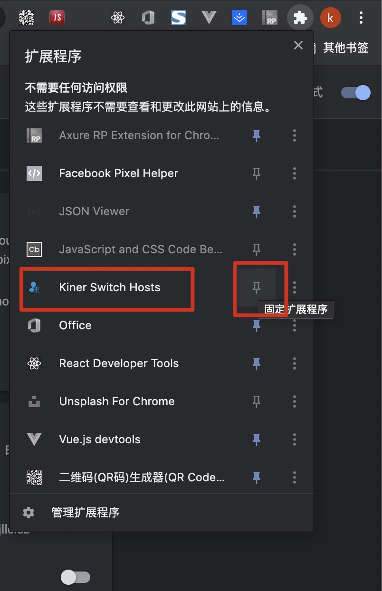
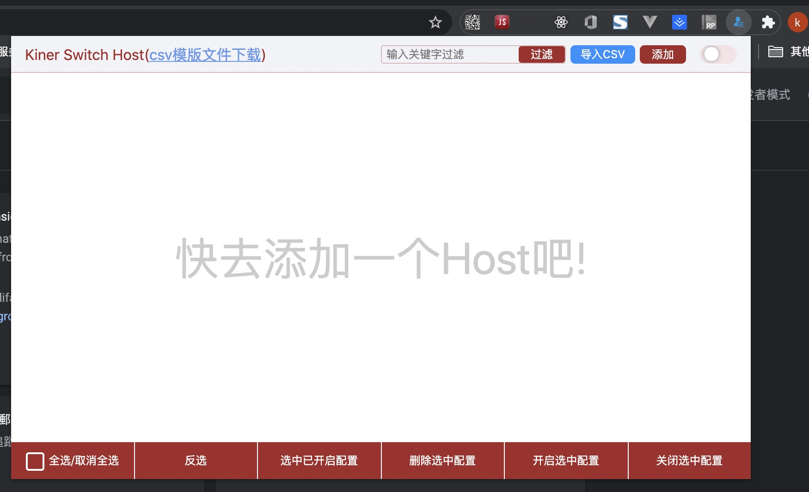
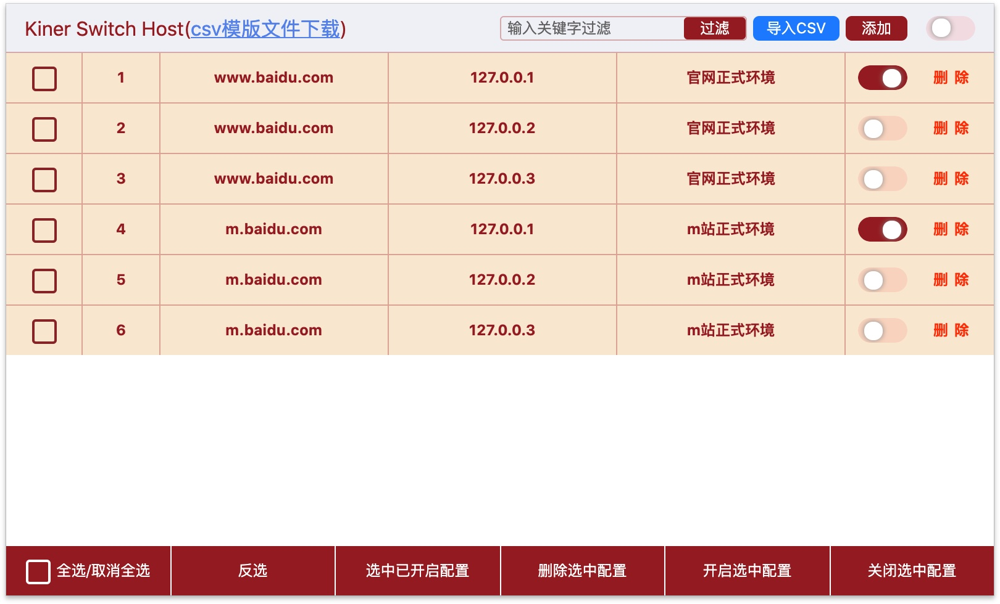
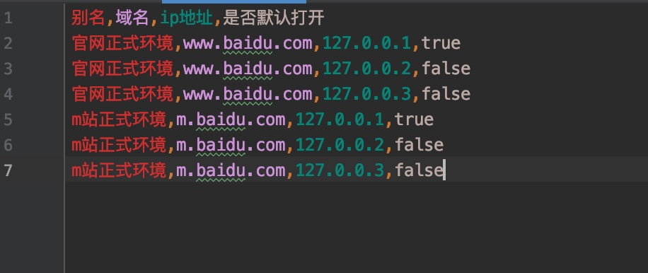
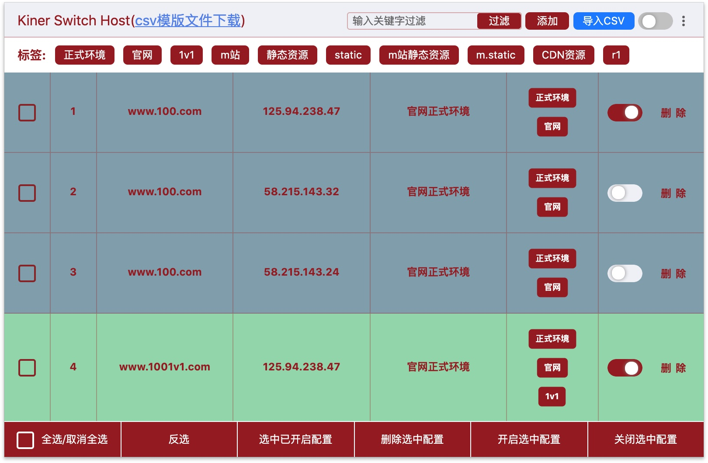
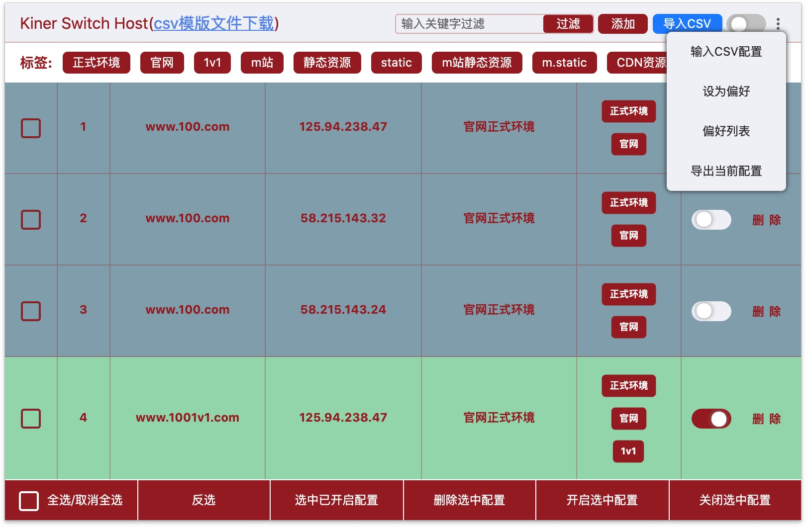

# chrome-extensions-kiner-switch-hosts
chrome快速切换host的扩展程序

## 已实现功能

- [x] 实时切换host
- [x] 对多个host配置进行统一管理
- [x] 支持导入csv数据
- [x] 支持批量开启和关闭
- [x] 支持批量删除
- [x] 实现switch host的偏好设置保存及切换功能
- [x] 实现switch host导出当前配置功能
- [x] 实现Csv格式文本直接录入功能
- [x] 根据域名实现分组变色功能
- [x] 增加配置标签即根据标签快速检索功能

## 使用方式

1. 将当前项目检出至本地
2. 打开`chrome`浏览器，在地址栏输入：`chrome://extensions/`
3. 点击`加载已解压的扩展程序`,选择当前项目的目录
4. 将`Kiner Switch Hosts`固定在菜单栏
    
    
## 效果

> 注意，上图中的域名和ip都是示例，实际使用时，请点击下载csv模版文件，并输入真实域名ip等信息。此外，除了导入csv文件之外，还可以手动添加host配置

